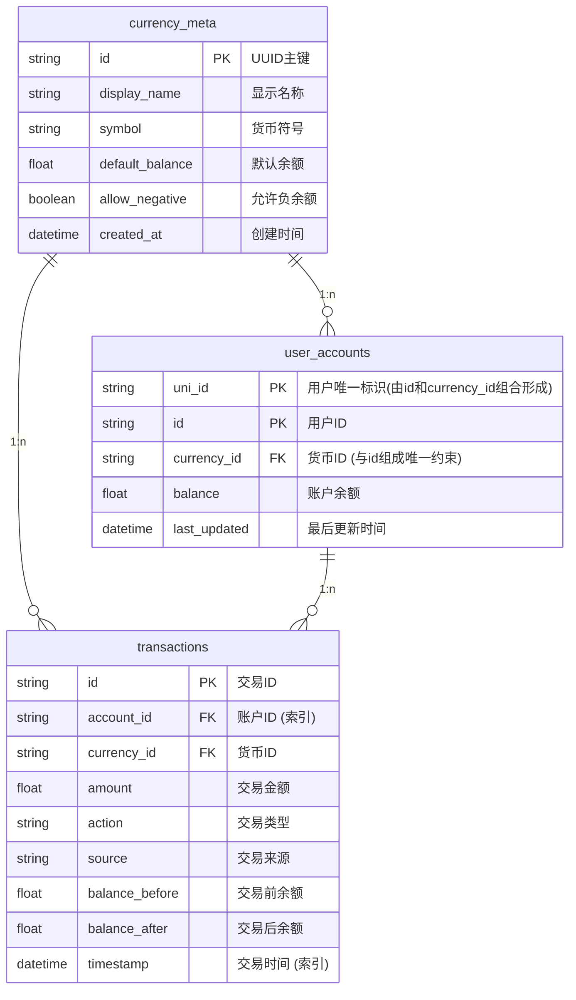

# nonebot_plugin_value 通用经济系统插件-API 文档

## 数据模型关系图

## API 文档

> 文档内,`~`表示**nonebot_plugin_value**模块

---

> 开发规范：我们推荐您使用 UUID.hex 作为唯一 ID，而不是直接传入 ID。

### [标准 API(表现层)](./apis/standard.md)

### [进阶 API(服务层)](./apis/advanced.md)

### [底层 API(数据层)](./apis/kernel.md)
