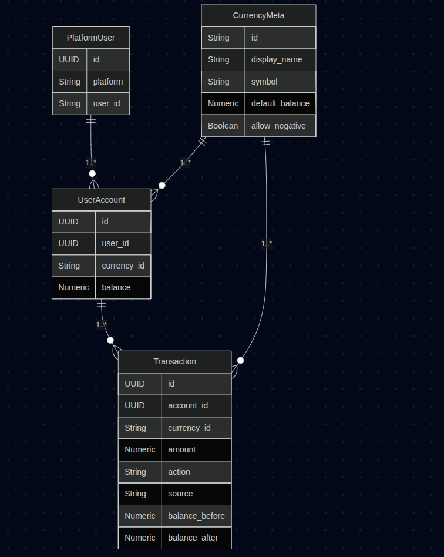

# nonebot_plugin_value 通用经济系统插件-API 文档

## 数据模型关系图



## API 文档

### 货币管理

#### 创建货币

```python
async def create_currency(session: AsyncSession, currency_data: CurrencyData) -> CurrencyMeta | None:
    """创建新货币（如果存在就与获取等效）"""
```

- **参数**：
  - `currency_data` 包含货币信息的对象（id 必填）
- **返回**：CurrencyMeta 实例或 None
- **示例**：

  ```python
  data = CurrencyData(id="gold", display_name="金币", symbol="💰")
  await create_currency(session, data)
  ```

#### 获取货币列表

```python
async def list_currencies(session: AsyncSession) -> Sequence[CurrencyMeta]:
    """获取已存在的货币"""
```

### 余额操作

#### 增加余额

```python
async def add_balance(
    session: AsyncSession,
    user_id: UUID,
    currency_id: str,
    amount: float,
    source: str = "",
) -> Dict[str, Any]:
    """异步增加余额"""
```

- **参数**：
  - `amount` 必须大于 0
  - `source` 交易来源描述（可选）
- **返回**：操作结果字典

#### 减少余额

```python
async def del_balance(
    session: AsyncSession,
    user_id: UUID,
    currency_id: str,
    amount: float,
    source: str = "",
) -> Dict[str, Any]:
    """异步减少余额"""
```

- **参数**：
  - `amount` 必须小于 0
- **特殊处理**：
  - 捕获 `CancelAction` 取消交易

#### 转账操作

```python
async def transfer_funds(
    session: AsyncSession,
    from_user_id: UUID,
    to_user_id: UUID,
    currency_id: str,
    amount: float,
    source: str = "transfer",
) -> Dict[str, Any]:
    """异步转账操作"""
```

#### 交易记录查询

```python
async def get_transaction_history(
    session: AsyncSession, account_id: UUID, limit: int = 100
):
```

- **原子操作**：使用行级锁保证事务性
- **自动创建**：源/目标账户不存在时自动创建

### 钩子系统

#### 钩子类型

```python
class HooksType:
    @classmethod
    def pre(cls) -> str:  # 交易前钩子
    @classmethod
    def post(cls) -> str: # 交易后钩子
```

#### 注册钩子

```python
hooks_manager = HooksManager()

@hooks_manager.on_event(HooksType.pre())
async def pre_transaction_hook(context: TransactionContext):
    """交易前钩子示例"""
    if context.amount > 1000:
        context.cancel("超过单笔交易上限")

# 或直接注册
hooks_manager.register(HooksType.post(), post_transaction_hook)
```

#### 钩子上下文

- **TransactionContext**：交易上下文

  - user_id: 用户 ID
  - currency: 货币 ID
  - amount: 交易金额
  - action: 操作类型（DEPOSIT/WITHDRAW 等）
  - cancel(): 取消交易方法

- **TransactionComplete**：交易完成上下文
  - source_balance: 原余额
  - new_balance: 新余额
  - timestamp: 交易时间

## 异常处理

- `CancelAction`: 通过调用 `context.cancel()` 触发取消交易
- 数据库异常：自动回滚并返回错误信息

## 依赖要求

- `nonebot2 >= 2.0.0`
- `nonebot-plugin-orm >= 0.1.0`
- `sqlalchemy >= 2.0.0`
- `pydantic >= 2.0.0`

## 数据库迁移

使用 nb-cli 进行数据库迁移

```bash
# 生成迁移脚本

nb orm revision -m "message" # -m 可选，添加信息

# 升级数据库
nb orm upgrade

```
