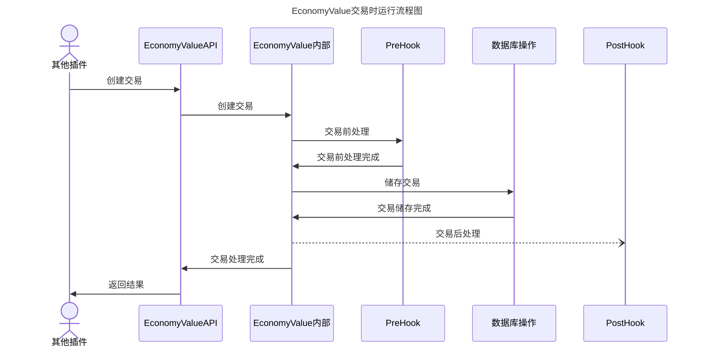

# EconomyValue-交易钩子函数文档

## 简介

钩子函数分为以下几类：

- **交易前**：在交易发生之前，可以进行一些预处理，如检查账户余额是否充足、检查交易金额是否合法等。
- **交易后**：在交易发生后，可以进行一些后续处理，如记录交易记录、发送交易通知等。

### 流程图



## API说明

API位置：`nonebot_plugin_value.hook`

### `hooks_manager`

`HooksManager` 是一个全局的单例钩子管理器，用于管理所有钩子。

```python
class HooksManager:

    def on_event(self, hook_name: str):
        """修饰器式的注册方法

        Args:
            hook_name (str): 事件名称
        """
        ...

    def register(
        self, hook_name: str, hook_func: Callable[..., Awaitable[None]]
    ) -> None:
        """注册一个Hook"""
        ...

    async def run_hooks(self, hook_name: str, context: BasicModel) -> None:
        """运行Hooks"""
        ...
```

方法说明：

1. `register`: 注册一个Hook，参数为Hook的名称和Hook函数。
2. `run_hooks`: 运行Hooks，参数为Hook的名称和上下文对象。
3. `on_event`: 一个装饰器，用于注册一个Hook，需要传入Hook的名称。

### `hooks_type`

`HooksType`是一个用于定义Hook的名称的类，它提供了两个静态方法`pre`和`post`，用于获取Hook的名称。

```python
class HooksType:
    __pre = "vault_pre_transaction"
    __post = "vault_post_transaction"

    @classmethod
    def pre(cls) -> str:
        return cls.__pre

    @classmethod
    def post(cls) -> str:
        return cls.__post

    @classmethod
    def valid_hooks(cls, hook_name: str) -> bool:
        return hook_name in [cls.__pre, cls.__post]

    @classmethod
    def methods(cls) -> list[str]:
        return [cls.__pre, cls.__post]
```

### `context`

`context` 是包含所有交易上下文信息的Pydantic模型。

```python

class TransactionContext(BaseModel):
    """Transaction context

    Args:
        BaseModel (BaseModel): pydantic BaseModel
    """

    user_id: str = Field(default_factory=str)  # 用户的唯一标识ID
    currency: str = Field(default_factory=str)  # 货币种类
    amount: float = Field(default_factory=float)  # 金额（+或-）
    action_type: str = Field(default_factory=str)  # 操作类型（参考Method类）

    def cancel(self, reason: str = ""):
        raise CancelAction(reason)


class TransactionComplete(BaseModel):
    """Transaction complete

    Args:
        BaseModel (BaseModel): pydantic BaseModel
    """

    message: str = Field(default="")
    source_balance: float = Field(default_factory=float)
    new_balance: float = Field(default_factory=float)
    timestamp: float = Field(default_factory=float)
    user_id: str = Field(default_factory=str)
```

说明：

1. `TransactionContext`: 交易上下文信息，预处理钩子使用，修改值不会传递到后续处理，但是您可以取消处理。

2. `TransactionComplete`: 交易完成信息，处理完成钩子使用。

## 示例

```python
from nonebot_plugin_value.hook.hooks_manager import HooksManager
from nonebot_plugin_value.hook.context import TransactionContext, TransactionComplete
from nonebot_plugin_value.hook.hooks_type import HooksType

hooks_manager = HooksManager()

@hooks_manager.on_event(HooksType.pre())
async def pre_hook(ctx: TransactionContext):
    print(f"pre_hook: \n{ctx.model_dump_json()}")
    if abs(ctx.amount) > 100000:
        print("金额过大，取消交易")
        ctx.cancel()

@hooks_manager.on_event(HooksType.post())
async def post_hook(cctx: TransactionComplete):
    print(f"post_hook: \n{cctx.model_dump_json()}")

```
